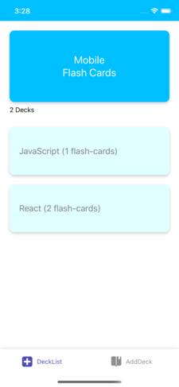
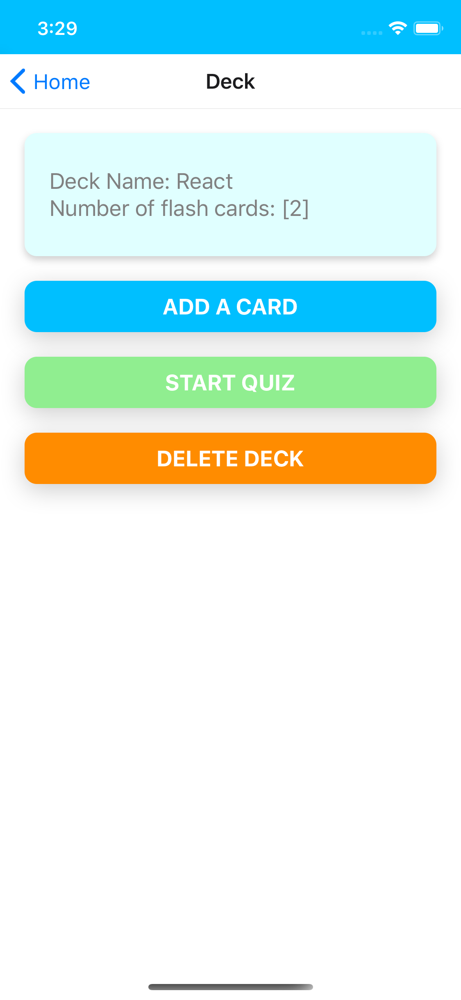
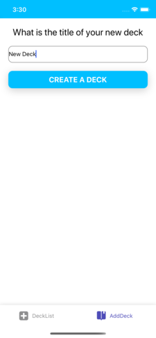

# React native project - Mobile Flashcards

"Flashcards" is a mobile application (Android or iOS - or both) that allows users to study collections of flashcards. The app will allow users to create different categories of flashcards called "decks", add flashcards to those decks, then take quizzes on those decks.

     

# Library and Tools

1. This project is implemented by using react-native
2. Xcode for iOS emulator (notification might not work for IOS emulator).
3. Genymotion for android emulator.

--------------------------------------------------------------------------------

# Functionality

1. A user can add a Deck.
2. A user can click a deck to see cards in that deck.
3. A user can add cards under a deck.
4. A user can quiz himself.
5. A user can delete a delete a deck.
6. Mobile Flashcards app sends notification to users, if they haven't finish at least one quiz for a day.

--------------------------------------------------------------------------------

# Install guide

1. $`npm install redux`
2. $`npm install react-redux`
3. $`npm install @react-navigation/native`
4. $`npm install @react-navigation/material-bottom-tabs`
5. $`npm install @react-navigation/bottom-tabs`
6. $`npm install @react-navigation/stack`
7. $`npm install @react-native-community/masked-view`
8. $`npm install react-native-tab-view`
9. $`npm install react-native-screens`
10. $`npm install react-native-gesture-handler`
11. $`npm install react-native-reanimated`
12. $`npm install expo-constants`
13. $`npm install react-native-paper`
14. $`npm install expo-notifications`
15. $`npm install expo-permissions`

--------------------------------------------------------------------------------

# Data Example

The there will be initial data which looks like following:<br>

```
React: {
  title: 'React',
  questions: [
    {
      question: 'What is React?',
      answer: 'A library for managing user interfaces'
    },
    {
      question: 'Where do you make Ajax requests in React?',
      answer: 'The componentDidMount lifecycle event'
    }
  ]
},
JavaScript: {
  title: 'JavaScript',
  questions: [
    {
      question: 'What is a closure?',
      answer: 'The combination of a function and the lexical environment within which that function was declared.'
    }
  ]
}
```

--------------------------------------------------------------------------------

# Problems might facing

## Expo start command does not work?

1. $`export PATH=$PATH:~/.npm-global/bin`
2. $`source ~/.bash_profile`
3. $`expo start`

## Environment set up

Reference: Udacity react native "Dev Environment Setup" secession.
